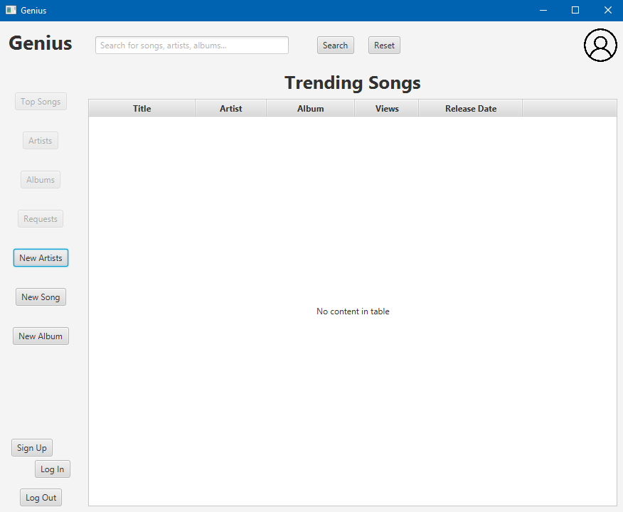
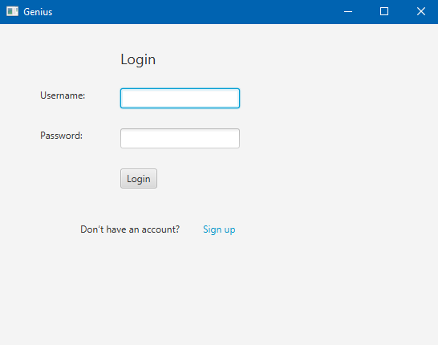
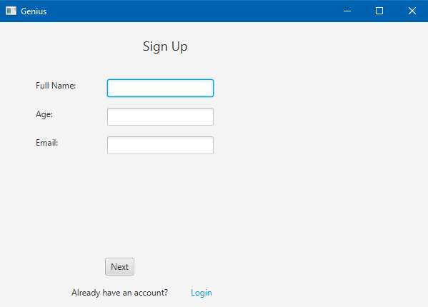
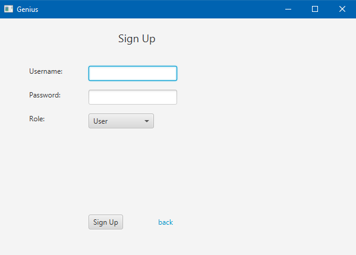
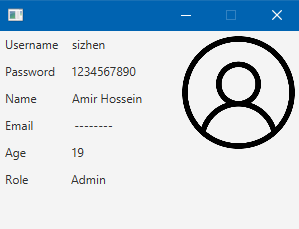
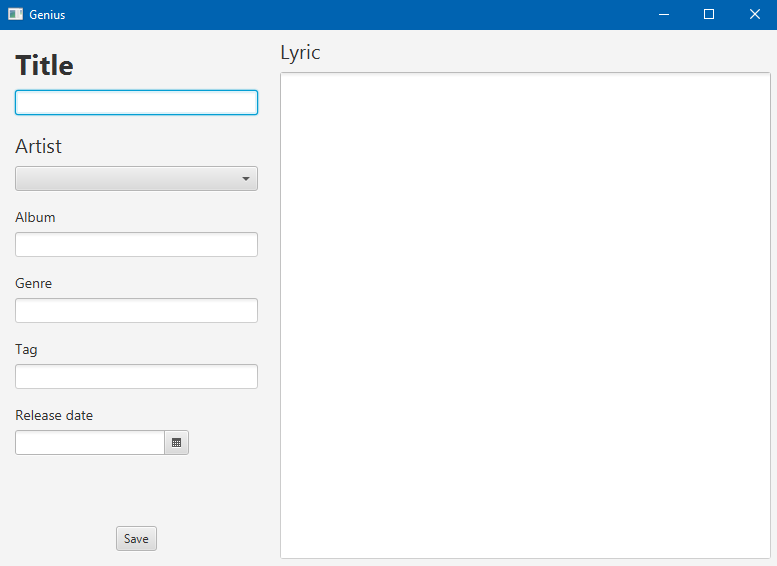
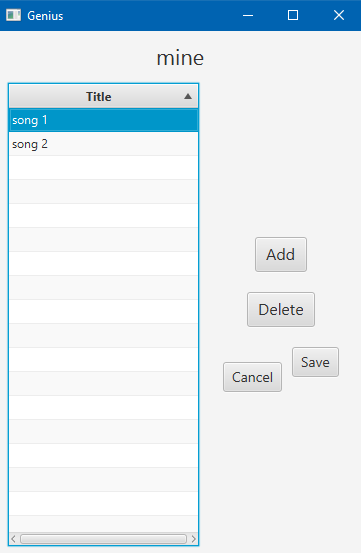
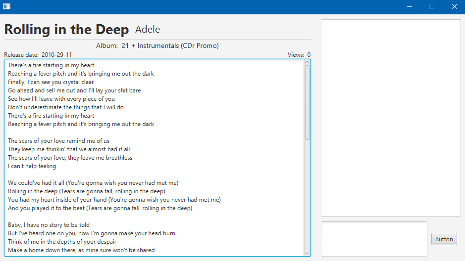

# Music Management Application

## 📌 Table of Contents
- [How to Use the Application](#how-to-use-the-application)
  - [Prerequisites](#prerequisites)
  - [Steps to Run the Application](#steps-to-run-the-application)
  - [Using the Application](#using-the-application)
    - [Sign Up](#sign-up)
    - [Log In](#log-in)
    - [Create a New Album](#create-a-new-album)
    - [View Trending Songs](#view-trending-songs)
    - [Navigate Between Pages](#navigate-between-pages)
    - [View Your Profile](#view-your-profile)
    - [Search Functionality](#search-functionality)
- [Project Structure](#project-structure)
- [Technologies Used](#technologies-used)
- [Future Enhancements](#future-enhancements)
- [Contributors](#contributors)
- [Acknowledgements](#acknowledgements)
- [Screenshots](#screenshots)

---

This is a JavaFX-based desktop application for managing music albums and songs. The application allows users to sign up, log in, create new albums, add songs to albums, and view trending songs. It is designed with a clean and user-friendly interface.

---


## How to Use the Application

### Prerequisites
- **Java Development Kit (JDK)**: Version 17 or higher.
- **Gradle**: Installed and configured.
- **IDE**: IntelliJ IDEA (recommended).

### Steps to Run the Application

1. Open the project in IntelliJ IDEA.

2. Build the project using Gradle:
  - Open the Gradle tool window in IntelliJ.
  - Run the `build` task.

3. Run the application:
  - Locate the `HelloApplication` class in the `src/main/java/sbu/cs/demo` package.
  - Right-click and select `Run`.

---

### Using the Application

#### Sign Up:
- Click on the "Sign Up" button on the login page.
- Fill in the required details and click "Sign Up".

#### Log In:
- Enter your username and password on the login page.
- Click "Log In" to access the main page.

#### Create a New Album:
- Navigate to the "New Album" page.
- Enter the album title and add songs by clicking the "Add" button.
- Save the album by clicking the "Save" button.

#### View Trending Songs:
- On the main page, view the list of trending songs in the table.

#### Navigate Between Pages:
- Use the back button to return to the previous page.
- Use the navigation options to switch between features.

#### View Your Profile:
- By clicking the avatar in the top right corner, you can view your profile.

#### Search Functionality:
- Users can search for albums, artists, song titles, and even lyrics using the search bar available on the main page for quick access to their favorite content.

---

## Project Structure

- `src/main/java/sbu/cs/demo`: Contains the main application classes and controllers.
- `src/main/resources/sbu/cs/demo`: Contains FXML files for the UI.
- `src/main/resources/img`: Contains images used in the application.
- `src/main/java/sbu/cs/demo/data`: Handles data persistence for albums and songs.

---

## Technologies Used

- **JavaFX**: For building the user interface.
- **Gradle**: For project build and dependency management.
- **FXML**: For defining the UI layout.
- **Java Collections**: For managing data in memory.
- **JSON**: For storing and retrieving users, albums, and songs data in a structured format.

---

## Future Enhancements

- Add more detailed error handling and validation.
- User can request to follow other users and view their public albums.
- User can request to change their password.
- Add a feature to change the lyrics of a song.
- Implement a more sophisticated UI design.

---

## Contributors

- **Your Name** 
- This is a personal project for practicing object-oriented programming concepts, but feel free to submit a pull request if you're interested.
---

### Acknowledgements

A special thanks to the professor and assistants for their guidance and support throughout the development of this project. Your feedback and encouragement have been invaluable!

## Screenshots



- This is the main page of the application where users can view trending songs and navigate to different features. From here, users can access their profile, create new albums, search songs, and view the list of trending songs.



- users, artists, and admins can log in to the application using their credentials. The login page is simple and user-friendly, allowing for easy access to the main features of the application.





- The sign-up page allows new users to create an account by entering their username, password, and other required details. The sign-up process is straightforward and ensures that users can quickly get started with the application.



- The profile page displays the user's information, including their username and a list of their created albums. Users can view and edit their profile details as needed.



- The new song page allows artists to add songs to their albums. Artists can enter the song title, artist name, and other relevant details before saving the song to their album.



- The new album page allows artists to create a new album by entering the album title and adding songs. Artists can save their albums and view them in their profile.



- The song detail page provides information about a specific song, including its title, artist, and lyrics. Users can view the details of their favorite songs and explore more about them. Also, users can comment on the song and view the comments of other users.

```